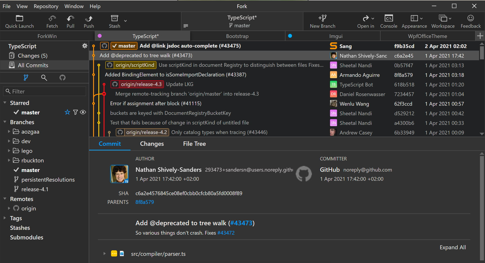
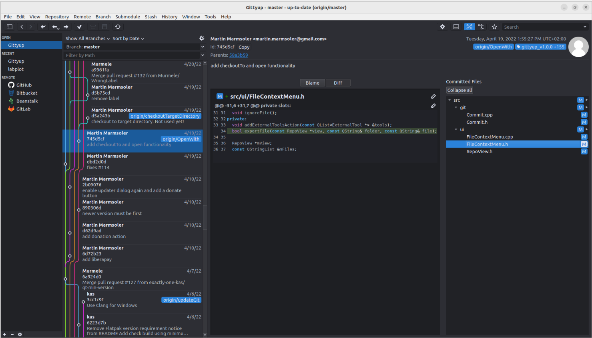
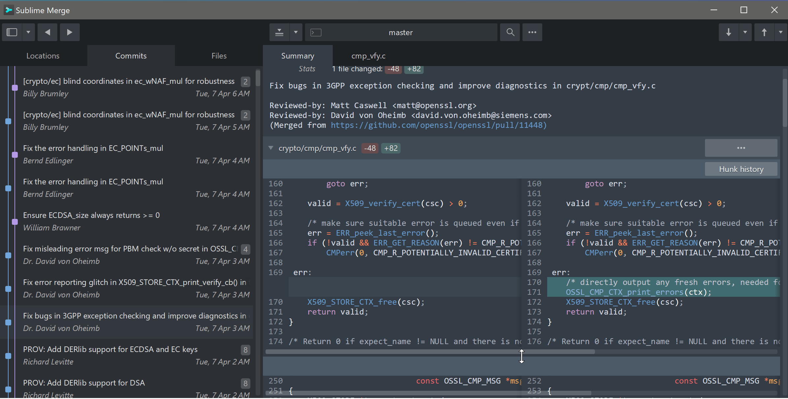
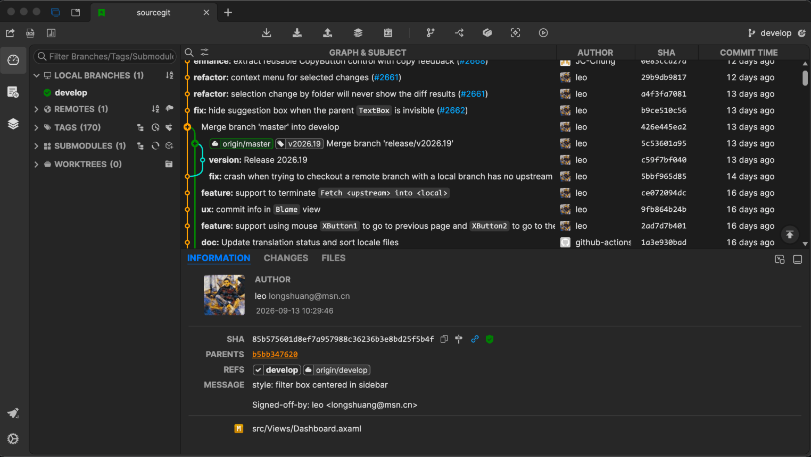
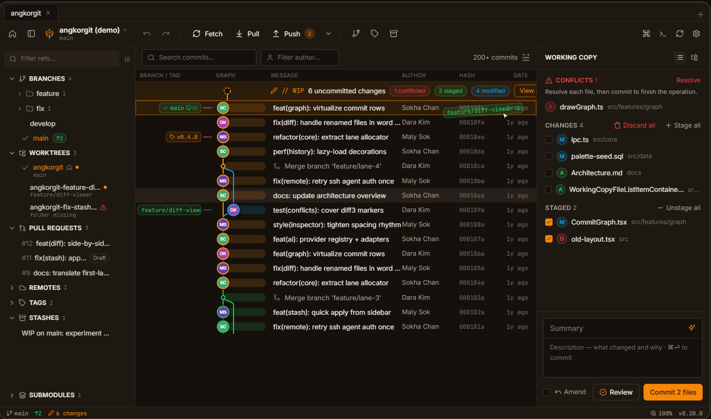

## 使用环境
- 操作系统：windows

  主要使用环境是 windows，计算机包括 windows 笔记本(多为 1920 * 1080 分辨率)、主机 + 外置显示器(1080/1200, 2k, 4k)

- git for windows portable

  软件如果有便携版，优先使用便携版

## 图形客户端

### 使用历程



使用 Fork (beta)


Fork 发布正式版本并开始收费，转到 GitAhead


使用 Sublime Merge


GitAhead 更新频率大幅放缓，转到新的 Fork 产品 Gittyup


体验国产 Git 客户端 SourceGit


Rust 现代 Git 客户端



### 使用体验

最初学习使用 git 时，需求比较简单：
1. 颜值高
2. 界面布局适配个人操作习惯和使用场景

通过 git for windows 官方网站上的 [图形客户端列表](https://git-scm.com/tools/guis) 查找适合自己使用的工具。

与 windows 资源管理器集成的 `TortoiseGit` 最先淘汰，因为我不大直接使用资源管理器；一些外观简陋的直接淘汰；一些命令行界面的直接淘汰；一些界面默认布局或操作不合适的也直接淘汰。

#### Fork 时期

第一个选中的是 `Fork`：

`Fork` 大约 2016 年 4 月开始发布，当时一直处于 beta 阶段，正在全力开发过程中。已完成功能基本稳定，并且可以免费使用（其实也是公开测试）。我很喜欢 `Fork`，日常使用很顺手。

然而免费终有结束的一天。大约 2020 年初，`Fork` 发布了 `1.0` 正式版，也宣告免费时代的结束。必须寻找其他替代产品了。

#### GitAhead 时期

继续在官网上查找和体验，把开源放在了必要条件中。这次找到了 `GitAhead`。这是一款开源、免费且跨平台（支持 Windows、macOS 和 Linux）的图形化 Git 客户端。它由著名的静态代码分析工具 `Understand` 的开发商 Scientific Toolworks, Inc.（SciTools）主导设计，底层基于 `Qt` 和 `C++` 编写，核心特点是拥有非常快速的原生级交互性能以及强大的代码历史搜索与可视化能力。

`GitAhead` 的界面主要分为 3 部分，左侧 commit tree，右侧上方是 file list，下方是 diff 区。这个默认视角非常符合我的需要。C++ 开发，资源占用较少，速度快。使用过程中我记得出过 1~2 次应用无响应，只能强制终止进程的情况。

我本以为大厂背景的产品可持续性要更强，然而事实是残酷的。`GitAhead` 在 2020 年 7 月发布了 `2.6.3` 版本后，很长一段时间没有新版本发布。开发者发文称自己没有多少时间投入到这个开源项目中（听起来感觉公司也没有支持他投入精力到这个开源项目）。`GitAhead` 的前景看起来一片灰暗，同时开始有开发者对仓库进行 fork 操作。2023 年 12 月 `GitAhead` 进行了 2 次回光返照式的更新，发布了 `2.7.0` 和 `2.7.1` 版本。这两个版本主要是废弃了一些旧架构的支持，升级了部分依赖包的版本，修复了一些问题，并没有大的变化。

`GitAhead` 在之后一段时间没有任何变化，最终大约 2025 年 3 月在 GitHub 上进行了归档操作，宣告自身生命周期的结束。

从使用者的角度，`GitAhead` 是一款很出色的产品。可惜没有资源投入，终究是走到了尽头。很可惜。

#### Gittyup 时期

在 `GitAhead` 作者发文后，就在慢慢寻找替代品。终于 `GitAhead` 的 fork 产品 `Gittyup` 上架了官网图形客户端列表。它不仅继承了 `GitAhead` 的开发，还做了一些优化调整。最直观的就是虽然保留了界面的 3 分区，但将右侧的上下布局改成了左右布局，使文件列表支持展开/闭合，同时也更适合宽屏显示器展示。

我大约在 2022 年开始使用 `Gittyup` 代替 `GitAhead`，一直使用到 `1.x` 版本的最后一个稳定版本 `1.4.0`，这个版本发布于 2024 年 5 月。然后 `Gittyup` 也开始了一段时间的沉寂，直到 2025 年年底发布了 `2.0` 版本。然而奇怪的是，仅发布了 Linux 下的 AppImage 和 flatpak 版本，没有 Windows 预编译版本和 Mac 版。于是只能继续用 `1.4` 版本。进入 2026 年，`Gittyup` 持续发布 `2.0` 后的开发预览版，这个时候才重新发布 Windows 版本（Mac 版本没有了，估计开发者精力有限，放弃了 Mac 平台）。

`Gittyup` 也是个非常优秀的产品，它继续了 `GitAhead` 的路，并且还持续提升。但是它最大的问题是采用了 `Qt` 开发，而 `Qt` 在 Windows 上对高分屏和缩放一直支持得不太好，导致在 4K 带缩放的显示器上文字不够清晰，只能忍痛割爱。不过它在 1080 分辨率屏幕上的效果还是很好的。`Gittyup` 的界面布局是我最熟悉和适应的。

#### Sublime Merge 时期

`Sublime Merge` 是大名鼎鼎的 `Sublime Text` 的开发商 © [Sublime HQ Pty Ltd](https://www.sublimehq.com/) 推出的新产品，界面与 `Sublime Text` 类似。作为 `Sublime Text` 用户，一定也是要安装体验的。我记得是从 1.0 版本就安装了，时间大概是 2020 年之前。不过因为不是开源产品，一直是私下个人使用。初期仅仅是尝鲜体验，大约 2021 年作为个人主要使用工具（工作中使用 GitAhead -> Gittyup）。

`Sublime Merge` 的界面风格与 `Gittyup` 比较类似，还有 `Sublime Text` 标志性的 Command Palette。整体比较好上手：

`Sublime Merge` 有与 `Sublime Text` 类似的问题：UI 区对中文支持不好。中文可以显示，但是不知道字体如何渲染的，显示效果非常糟糕。必须通过额外处理明确指定中文字体才能解决。

另外，与 `Sublime Text` 不同的是，它没有 Package Control，也没有丰富的第三方主题（GitHub 上貌似只有 `dracula` 和 `meetio` 主题）。默认的 `Dark` 主题需要**付费版本**才能解锁使用。

Sublime HQ 本身是个澳大利亚的小公司，`Sublime Text` 这个产品还是非常出色的，也非常流行。`Sublime Merge` 的付费版本我相信销量可能远不如 `Sublime Text`，网络上一些国外网友留言“不会为一个 Dark 主题付 99 刀”。但是 Sublime HQ 的两个产品全部可以免费使用（会不定时弹出付费通知），还是很良心的。

`Sublime Merge` 是一直在使用的产品，但没有付费。

#### SourceGit 时期

使用 `SourceGit` 大约是 2025 年了。因为 `Gittyup 2.0` 没有 Windows 版的问题，需要找一个开源替代。又因为 Rust 的日益流行，想找一个 Rust 开发的产品，`SourceGit` 出现在了视野。

`SourceGit` 的界面风格与 `GitAhead` 也是类似的，只不过 3 个区域位于 2 个不同的标签中：

`SourceGit` 基于 Rust 和 Tauri 开发，支持多平台，GitHub 上还有很多第三方的 Theme。更新频率也很高，大约 2 周就有一个新版本。另外值得一提的是，`SourceGit` 应该是国人作品，默认对中文的支持很好。无安装版，仅提供压缩版。

#### 附：其他小众产品

让 AI 推荐非 Electron 和 Qt 技术，优先 Rust 开发的 Git 图形客户端，AI 推荐了 2 个：

1. AngkorGit

  是个柬埔寨小伙的作品，Angkor 指的是“吴哥窟”。现在是 `0.x` 的预览阶段，开发活跃度比较高。默认还有 AI 集成接口。只是个人作品不知道可持续性如何。

  感觉界面风格还是挺现代的，速度快，资源占用少。

2. GitButler

  严格说这不是个传统的“Git 图形客户端”，它的卖点是自身开创的 Git 工作流。不是我关注的点，因此没有安装体验。背靠商业公司，据说已拿过风险投资，感觉可持续性应该强得多。
