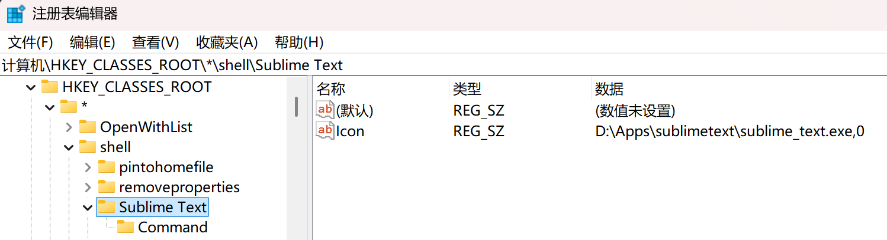
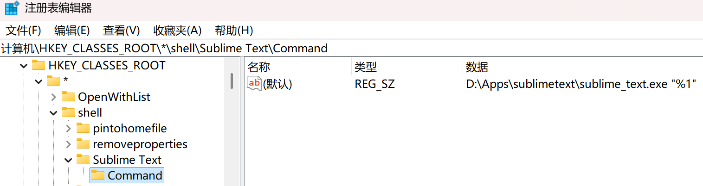

## 说明
为方便 sublime text 作为文本编辑器使用，将其添加到鼠标右键菜单中，资源管理器中任意**文本文件**上鼠标右击，可以通过 sublime text 打开该文件。
> 假定 sublime text 应用安装在 `D:\Apps\sublimetext` 目录下

## 操作步骤
1. `win + R` 输入 `regedit` 打开注册表编辑器
1. `HKEY_CLASSES_ROOT -> * -> shell -> 右键 -> 新建 -> 项`，输入右键菜单名称，如：`Sublime Text` (即鼠标右键的菜单项名称)
1. `"Sublime Text" -> 右键 -> 新建 -> 字符串值` 打开"编辑字符串"窗口：
   "数值名称"输入：`Icon`，"数值数据"输入：`D:\Apps\sublimetext\sublime_text.exe,0` (即鼠标右键的菜单项图标)
   
1. `"Sublime Text" -> 右键 -> 新建 -> 项`，输入 `Command`：右侧自动生成一条名称为"(默认)"的数据
1. 双击该数据打开"编辑字符串"窗口：
   "数值数据"输入：`D:\Apps\sublimetext\sublime_text.exe "%1"`
   > 注意 `%1` 两侧必须带有双引号(`"`)。这个参数是鼠标右击后传递给 sublime text 的文件名，用双引号扩起来以便支持带空格的文件名

   
1. 完成后退出注册表编辑器
1. 打开资源管理器，在任意文本文件上鼠标右击，确认 `Sublime Text` 菜单正常显示，点击后在 sublime text 中加载该文件

## 补充：添加至 "发送到"(Send to) 菜单
将 sublime text 添加到鼠标右键菜单后，有一个限制：只能针对单一文件。如果想选中多个文本文件后全部用 sublime text 打开，可以将 sublime text 添加到鼠标右键的 "发送到" 菜单：
1. 打开资源管理器，输入地址：`%APPDATA%\Microsoft\Windows\SendTo`
1. 窗口空白处：`鼠标右键 -> 新建 -> 快捷方式`：创建一个指向 `sublime_text.exe` 的快捷方式 `Sublime Text`
1. 在资源管理器中：`选择一个或多个文本文件 -> 右键 -> 发送到`：菜单中新增 `Sublime Text`，选择后文件即在 sublime text 中打开
