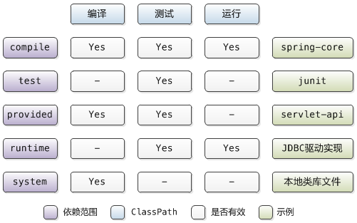
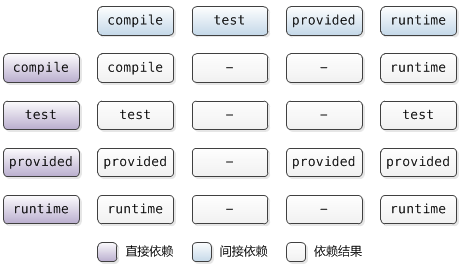

## 坐标

坐标是 Maven 构件的唯一标识。坐标由 `groupId`、`artifactId`、`version`、`packaging`、`classifier` 构成。

- `groupId`：组织的实际项目名，建议使用**组织的域名反向+项目名称**，如 `org.apache.maven.plugins`。
- `artifactId`：Maven 项目（模块）名，建议使用**实际项目名**作为模块的前缀，如 `maven-compiler-plugin`。
- `version`：Maven 项目的版本。版本号约定为 `<主版本>.<次版本>.<增量版本>-<里程碑版本>`，如 `1.2.3-beta-1`。Maven 还定义了 `SNAPSHOT` 快照版本，用于持续更新发布。
- `packaging`：Maven 项目的打包方式，通常与生成的构件的扩展名对应，如 `jar`，`war`。默认为 `jar`。
- `classifier`：用于帮助定义构建输出的一些附属构件。常见的使用场景如针对不同 JDK 版本（如 `jdk5`）。

坐标的5个元素中，`groupId`、`artifactId`、`version` 是必须指定的，`packaging` 可选（默认为 `jar`），`classifier` 是不能直接定义的（由辅助的插件帮助生成）。

Maven 构建出的文件的文件名一般为：`artifactId-version[-classifier].packaging`。

## 依赖

依赖的解决实际是 Maven 在 classpath 中添加相应的包。Maven 项目的依赖由 `pom.xml` 中的 `<dependency>` 元素设置。dependency 元素中常用的子元素包括：

- `groupId`、`artifactId`、`version`：依赖的基本坐标。
- `type`：依赖的类型，对应于坐标的 `packaging`。一般无需声明，默认为 `jar`。
- `scope`：依赖的范围。
- `optional`：是否为可选依赖。
- `exclusions`：用于排除传递性依赖。

### 依赖范围



其中 `compile` 是默认的依赖范围。

### 传递性依赖

项目声明依赖构件 A，而 A 声明依赖构件 B，则项目对构件 B 有传递性依赖。项目只需声明直接依赖，Maven 会通过传递性依赖机制自动处理间接依赖。

依赖范围对传递性依赖有影响：



### 依赖调解

依赖调解用于解决依赖的**冲突**。例如项目依赖了构件 A、B，A 和 B 都间接依赖了 X，但 A 依赖了 X 的 1.0 版本，B 依赖了 X 的 2.0 版本，则产生了依赖冲突。

Maven 依赖调解的原则：

1. **最短路径优先**：传递的路径短者优先。如 A 对 X 的 1.0 版本的依赖路径为 A -> C -> X（1.0），B 对 X 的 2.0 版本的依赖路径为 B -> D -> E -> X（2.0），由于 X 1.0 的路径长度（2） < X 2.0 的路径长度（3），则最终依赖为 X 1.0。
2. **先声明者优先**：如果路径相同，则使用声明在前的依赖。

### 可选依赖

如果依赖的 `optional` 元素设置为 `true`，则不会产生传递性依赖。如项目 A 依赖 B，B 依赖 X（可选），则 A 不依赖于 X。

可选依赖的使用场景一般为某个构件提供了多种实现，需根据情况显式选择一种。例如提供了基于 Oracle、MySQL 等多种持久层实现时，根据采用的数据库选择对应的实现。

### 排除依赖

排除依赖显式的解除某传递性依赖。一般用于替换某传递性依赖的版本。例如 A 依赖 B，B 依赖 X 的版本 1.0。可将 B 对 X 的依赖通过 `exclusion` 元素排除，然后显式指定 A 依赖 X 的 1.0.1 版本（此场景虽然可以通过依赖调解实现，但通过显式指定使用的版本看起来更清晰）。

`exclusion` 元素中只需 `groupId` 和 `artifactId` 即可，无需 `version` 元素。

## 生命周期和插件

### 生命周期

Maven 为项目的构建过程抽象了统一的生命周期，涵盖了项目的所有构建步骤。

Maven 内置了 3 套相互独立的生命周期：`clean`、`default`、`site`，每个周期又分为多个阶段（`phase`）。周期的阶段是有顺序的，后边的阶段的执行依赖之前的阶段，即执行后边阶段时 Maven 会自动依次执行之前的阶段。

#### clean 生命周期

clean 生命周期主要做清理项目的工作。

- pre-clean
- clean
- post-clean

#### default 生命周期

default 生命周期定义了真正构建时需要执行的所有步骤。

- validate
- initialize
- generate-sources
- process-sources
- generate-resources
- process-resources
- compile
- process-classes
- generate-test-sources
- generate-test-resources
- process-test-resources
- test-compile
- process-test-classes
- test
- prepare-package
- package
- pre-integration-test
- integration-test
- post-integration-test
- verify
- install
- deploy

#### site 生命周期

- pre-site
- site
- post-site
- site-deploy

#### 命令行与生命周期

常用的 Maven 命令实际调用了 Maven 的生命周期阶段。如：

- `mvn clean` 命令：调用 clean 生命周期的 clean 阶段（实际执行 pre-clean 和 clean 阶段）
- `mvn test` 命令：调用 default 生命周期的 test 阶段（实际执行 validate -> test 的所有阶段）
- `mvn clean install` 命令：调用 clean 生命周期的 clean 阶段 + default 生命周期的 install 阶段
- `mvn clean deploy site-deploy` 命令：调用 clean 生命周期的 clean 阶段 + default 生命周期的 deploy 阶段 + site 生命周期的 site-deploy 阶段

### 插件

Maven 的核心仅仅定义了抽象的生命周期，而实际的功能是通过插件实现的。插件以独立的 Maven 构件的形式存在，在需要时 Maven 自动从仓库下载。每个 Maven 的插件实现一类功能，每个功能是一个插件目标（Goal）。

Maven 插件的目标需要与指定的生命周期的阶段相绑定，用以完成具体的构建任务。

#### 内置绑定

Maven 内置了很多绑定，从而默认可以执行大部分的构建功能：

**clean 生命周期：**

- clean 阶段：`maven-clean-plugin:clean`

**default 生命周期：**

- process-resources 阶段：`maven-resources-plugin:resources`
- compile 阶段：`maven-compiler-plugin:compile`
- process-test-resources 阶段：`maven-resources-plugin:testResources`
- test-compile 阶段：`maven-compiler-plugin:testCompile`
- test 阶段：`maven-surefire-plugin:test`
- package 阶段：`maven-jar-plugin:jar`
- install 阶段：`maven-install-plugin:install`
- deploy 阶段：`maven-deploy-plugin:deploy`

**site 生命周期：**

- site 阶段：`maven-site-plugin:site`
- site-deploy 阶段：`maven-site-plugin:deploy`

#### 自定义绑定

除内置绑定外，可以通过 `plugin` 元素中的 `execution` 子元素自行将某插件目标绑定到生命周期的某个阶段，从而完成自定义功能。

例如下述配置将 `maven-source-plugin:jar-no-fork` 目标绑定在 `package` 阶段，构建生成源代码包：

```xml
<plugin>
    <groupId>org.apache.maven.plugins</groupId>
    <artifactId>maven-source-plugin</artifactId>
    <version>2.1.2</version>
    <executions>
        <execution>
            <id>attach-sources</id>
            <phase>package</phase>
            <goals>
                <goal>jar-no-fork</goal>
            </goals>
        </execution>
    </executions>
</plugin>
```

#### 从命令行调用插件目标

有些插件目标不适合绑定在生命周期阶段上（例如 `maven-help-plugin` 的 `describe` 目标），因此 Maven 支持在命令行调用插件目标。

Maven 调用插件目标的格式为：`mvn 插件groupId:插件artifactId:插件version:插件goal`

例如：`mvn org.apache.maven.plugins:maven-dependency-plugin:2.1:tree`

但插件的坐标比较长，不易记忆，因此 Maven 引入了插件**前缀**的概念，例如 `dependency` 是 `maven-dependency-plugin` 的前缀，上述命令可以简化为 `mvn dependency:tree`。

*注：实际上插件前缀只对应到插件的 `artifactId`。Maven 会根据仓库元数据（`maven-metadata.xml`）信息及内置规则解析到对应的 `groupId`、`artifactId`、`version`，从而定位到唯一的插件。*

## 聚合与继承

### 聚合

较大的 Maven 项目一般会被拆分成多个**模块（module）**（例如 `springframework` 分为 `spring-core`、`spring-context` 等）。如果每次构建整个项目时都需要依次构建多个模块就显得十分不便。Maven 通过聚合模块将一组模块进行统一管理。

聚合模块只有一个 `pom.xml` 文件，且坐标中的 `packaging` 元素固定为 `pom`。被聚合模块管理的其他模块通过 `modules` 元素声明：

```xml
<modules>
    <module>module-1</module>
    <module>module-2</module>
</modules>
```

聚合模块一般为**主从结构**，即被聚合的模块作为聚合模块的子目录存储。但此要求不是必须的，也可以将聚合模块与被聚合模块平级存储，这时需要注意修改 `module` 元素中的路径：

```xml
<modules>
    <module>../module-1</module>
    <module>../module-2</module>
</modules>
```

定义了聚合模块之后，就可以通过聚合模块对其包含的所有模块统一进行构建操作了。

### 继承

继承的目的主要是**消除重复**。例如模块 A 和模块 B 都包含单元测试，那么两个模块都需要定义 junit 依赖，造成了重复。可以将 junit 依赖声明在统一的父模块中，模块 A 和 B 都继承自父模块，自身就无需定义 junit 依赖了。

父模块只有一个 `pom.xml` 文件，且坐标中的 `packaging` 元素固定为 `pom`。在子模块中通过 `parent` 元素声明继承关系：

```xml
<parent>
    <artifactId>project</artifactId>
    <groupId>com.company</groupId>
    <version>1.0.0-SNAPSHOT</version>
</parent>
```

需要注意的是，Maven 默认父模块和子模块的目录结构为**主从关系**，即父模块在子模块的上一级目录。如果设定为平行关系，需要在 `parent` 元素中通过 `relativePath` 元素声明：

```xml
<parent>
    <artifactId>project</artifactId>
    <groupId>com.company</groupId>
    <version>1.0.0-SNAPSHOT</version>
    <relativePath>../parent/pom.xml</relativePath>
</parent>
```

Maven 的聚合模块和继承模块在概念上是独立的，但在表现形式上很相似。因此实际项目中可以将聚合模块和继承模块合二为一。
