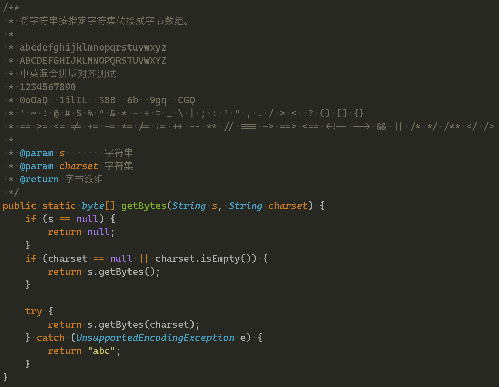
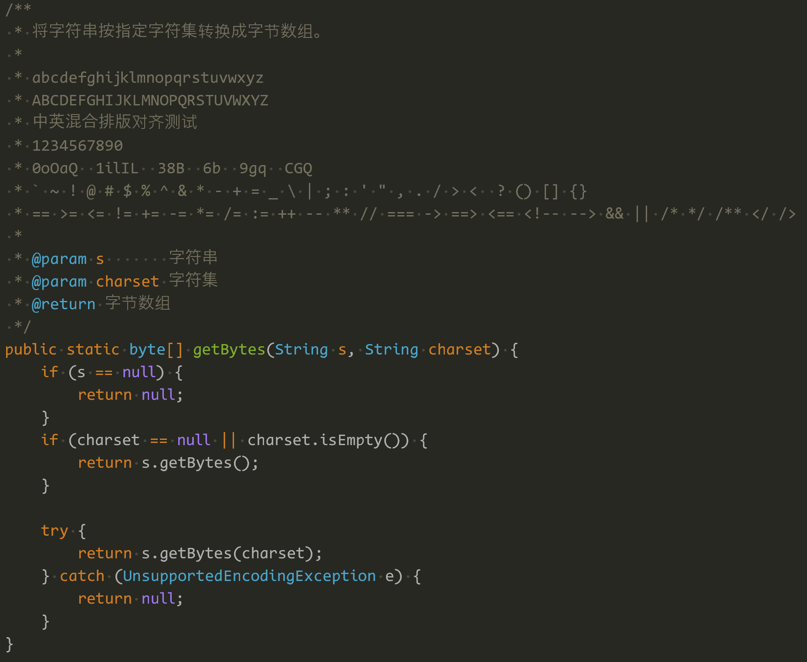

## 编程字体的关注点

- 等宽
- 区分易混淆字符
- 是否支持连字(ligatures)
- 中英混合排版是否对齐(中英字符宽度比是否2:1)

## 测试环境

- 操作系统：windows 11
- 编辑器：sublime text 4

---

## 字体展示

**说明：**

1. 以下按字体名称排序

2. 英文字体显示中文时一般会 fallback 到操作系统默认的中文字体，理论上 windows 11 会调用"微软雅黑"字体显示。但可能是 sublime text 字体渲染的原因，以下图中各英文字体的中文显示部分看起来不像是完全由"微软雅黑"显示，比如"将"字的字型跟"微软雅黑"有出入（sublime text 在页签中显示中文文件名时存在类似问题）

3. 各编程用字体基本上在"等宽"、"区分易混淆字符"这两点上都满足要求，因此评价中不再赘述

4. 代码片段只是展示字体效果，忽略内容正确性

5. 评价仅为个人主观意见

### Cascadia Code

效果图：

评价：

1. 中英宽度比非2:1
2. 不太喜欢小写字母"a"、"u"的小尾巴

### Code New Roman

效果图：

评价：

1. 不支持连字
2. 中英宽度比非2:1
3. "()"的弧度有点过大了，成对的小括号几乎闭合成一个圆
4. 字体文件的 metadata 似乎并未区分斜体和粗体