## 编程字体的关注点

- 等宽
- 区分易混淆字符
- 是否支持连字(ligatures)
- 中英混合排版是否对齐(中英字符宽度比是否 2:1)

## 测试环境

- 操作系统：windows 11
- 编辑器：sublime text 4，默认暗色主题，配色方案 MonokaiEasyForRetina

## 字体展示

**说明：**

1. 以下按字体名称排序

1. 英文字体显示中文时一般会 fallback 到操作系统默认的中文字体，理论上 windows 11 会调用"微软雅黑"字体显示。但可能是 sublime text 字体渲染的原因，以下图中各英文字体的中文显示部分看起来不像是完全由"微软雅黑"显示，比如"将"字的字型跟"微软雅黑"有出入（sublime text 在页签中显示中文文件名时存在类似问题）

1. 各编程用字体基本上在"等宽"、"区分易混淆字符"这两点上都满足要求，因此评价中不再赘述

1. 代码片段只是展示字体效果，忽略内容正确性

1. 评价仅为个人主观意见

### Cascadia Code

Microsoft 官方出品，Microsoft Terminal 默认字体，字重相对较粗。官方还推出了一款名为 [Cascadia Next](https://github.com/microsoft/cascadia-code/releases/tag/cascadia-next) 的 CJK 字体的预览版，截止当前已经预览 2 年了，不知道该字体是否还在继续。

效果图：

评价：

1. 中英宽度比非 2:1

1. 不太喜欢小写字母 "a"、"u" 的小尾巴

### Code New Roman

效果图：

评价：

1. 不支持连字

1. 中英宽度比非 2:1

1. "()" 的弧度有点过大了，成对的小括号几乎闭合成一个圆

1. 字体文件的 metadata 似乎并未区分斜体和粗体，导致识别可能有点问题

### Courier Prime Code

显示效果：

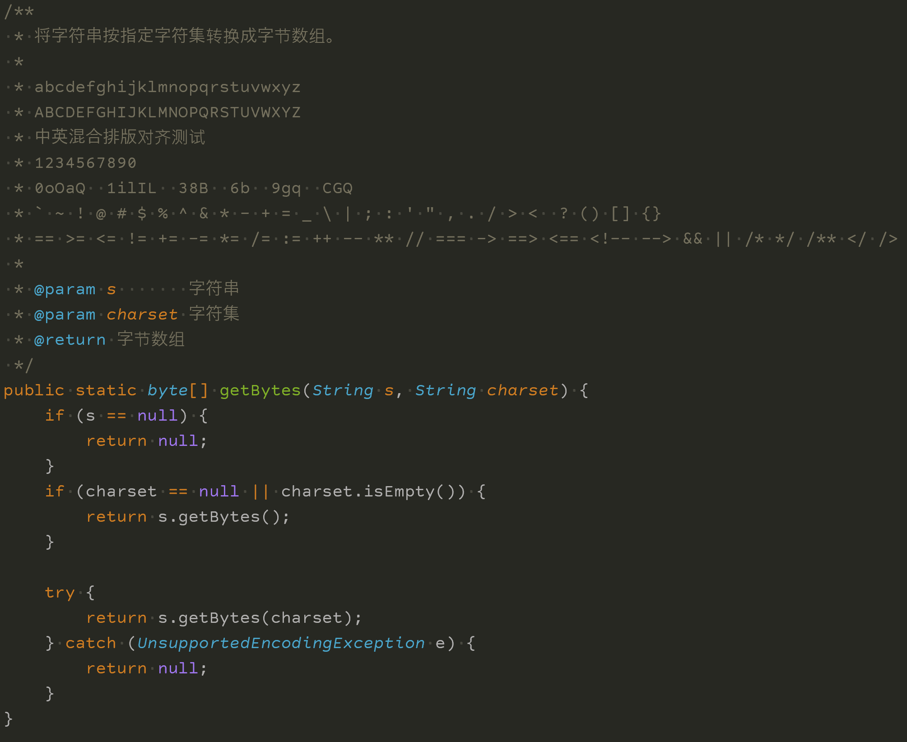

评价：

1. 不支持连字

1. 中英宽度比非 2:1

1. 字符间距挺宽的，显得不拥挤

1. 挺不错的字体，除了 mono 字体外还有 sans 和 serif 两种普通字体

### Fantasque Sans Mono

显示效果：

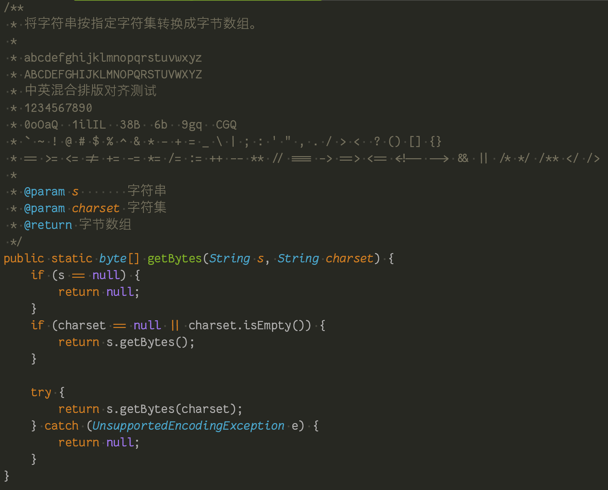

评价：

1. 中英宽度比非 2:1
2. 字体稍微有点非正统的风格，比如小写字母 "m"、"n" 最后一笔的小尾巴。看惯了一板一眼风格的字符后可以换一下体验
3. 自带了两种不同风格字母 "k" 的字体文件，除了这里的标准风格的 "k"，还有一种类似手写体的带圆圈的 "k"

### Fira Code

非常著名且使用广泛的字体，连字支持非常完善。有其他字体专门从 Fira Code 中提取连字设计。

显示效果：

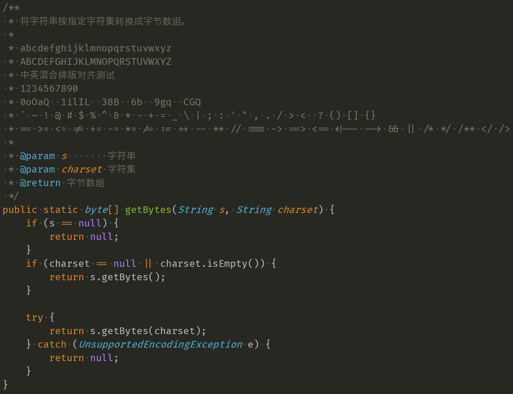

评价：

1. 中英宽度比非 2:1
2. 不是很喜欢字符 "@" 的风格
3. 小写字母 "r" 是 Fira Code 标志性字符，是否喜欢则见仁见智
4. 图中实际使用字体是 Fira Code Retina，虽然也没看出来和标准版本有什么区别

### Hack

显示效果：

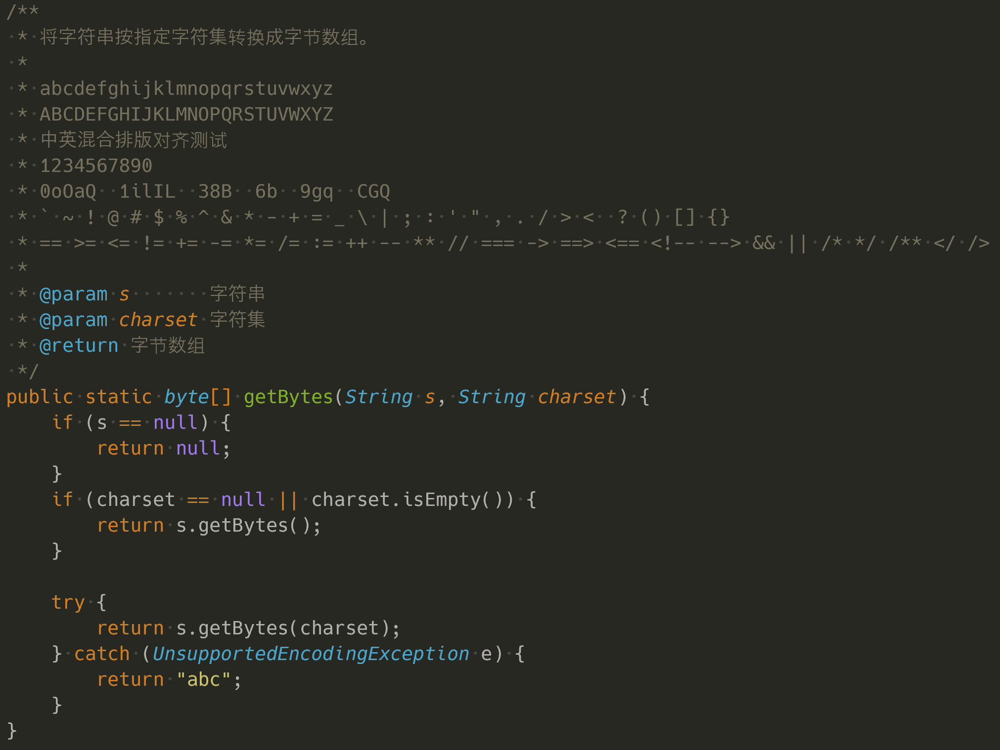

评价：

1. 不支持连字
2. 中英宽度比非 2:1
3. "i"、"l" 的向右的小尾巴挺好的
4. 中规中矩的字体，挺好的

### Hermit

显示效果：

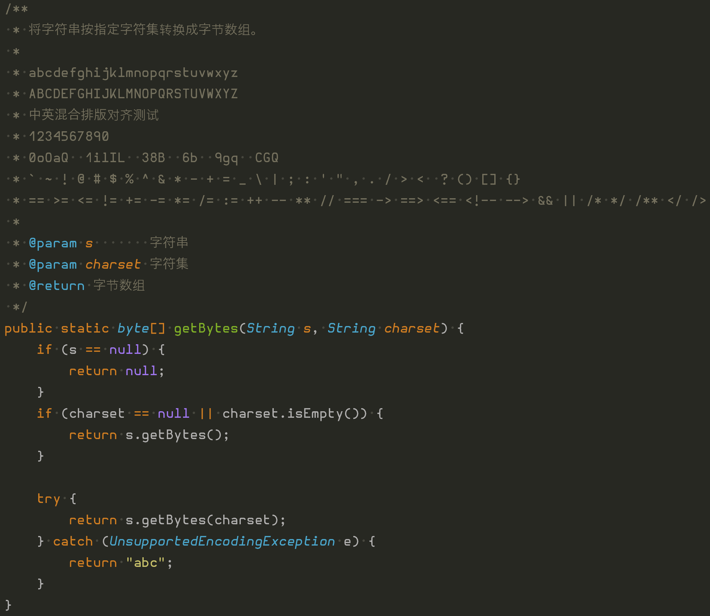

评价：

1. 不支持连字
2. 中英宽度比非 2:1
3. "i"、"j" 上的圆点感觉有点重
4. 这个字体也是稍有一点**另类**的字体，偶尔可以换一换口味

### IBM Plex Mono

显示效果：

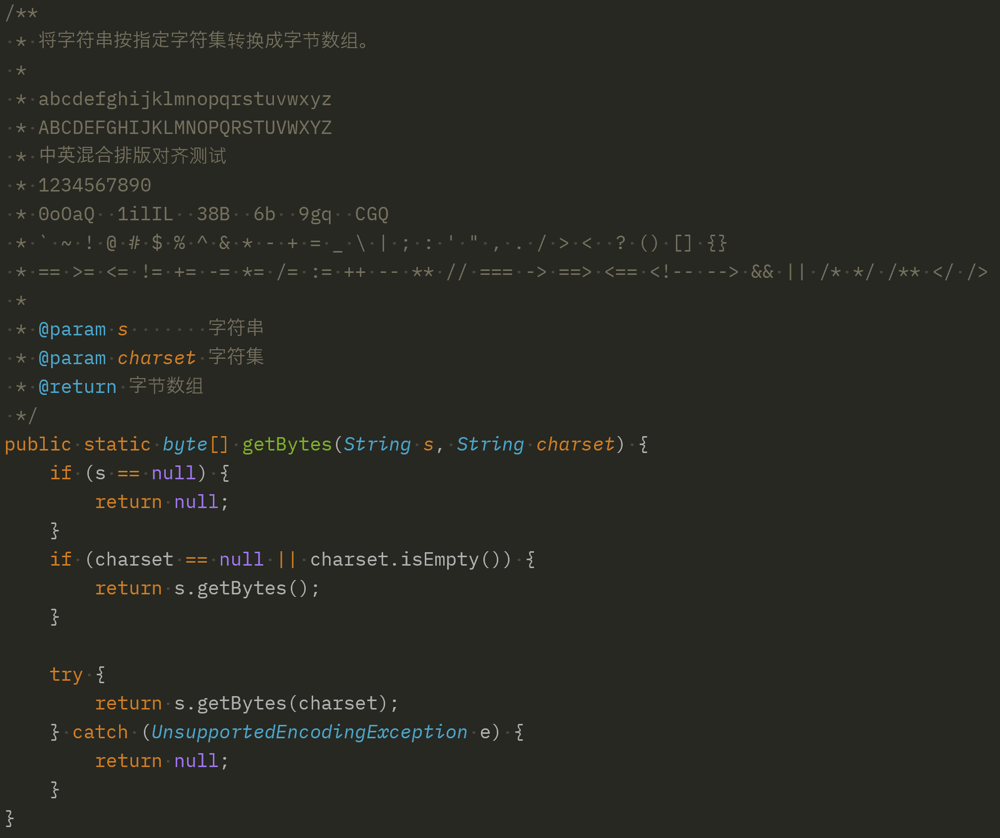

评价：

1. 不支持连字
2. 中英宽度比非 2:1
3. IBM 出品，总感觉一种古板的气息。斜体的 "t"、"i" 的小尾巴竟然几乎一样，"x" 又突然有点跳脱的感觉。总之不是我的喜好

### Inconsolata

显示效果：

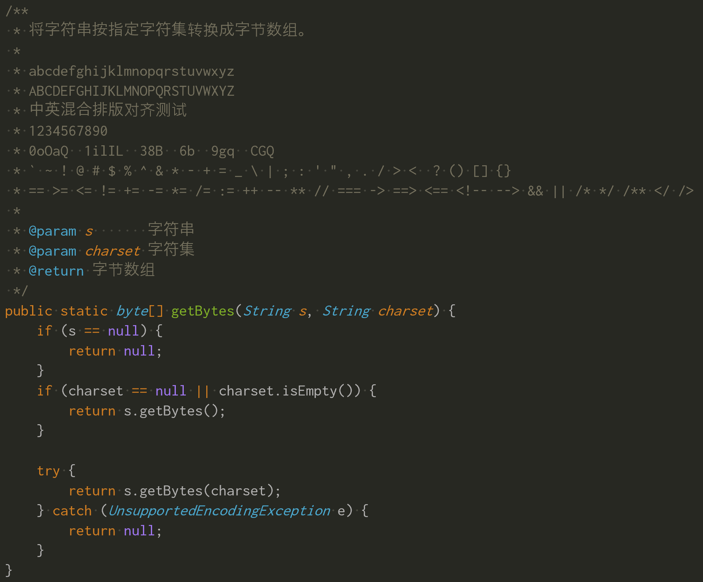

评价：

1. 不支持连字
2. 虽然没看到明确声明，但从显示上看，中英宽度比 2:1，混合排版是可以对齐的
3. 中英宽度 2:1 说明这款字体是偏瘦的
4. 本字体除标准的Light、Bold等多种字重外，还提供了 Condensed、SemiCondensed、ExtraCondensed、UltraCondensed、Expanded、SemiExpanded、ExtraExpanded、UltraExpanded 等多种版本，但这些版本混合中文后中文似乎调用了宋体显示，很奇怪。完全不喜欢 windows 下的宋体显示，用的话就老老实实用标准版

### Intel One Mono

显示效果：

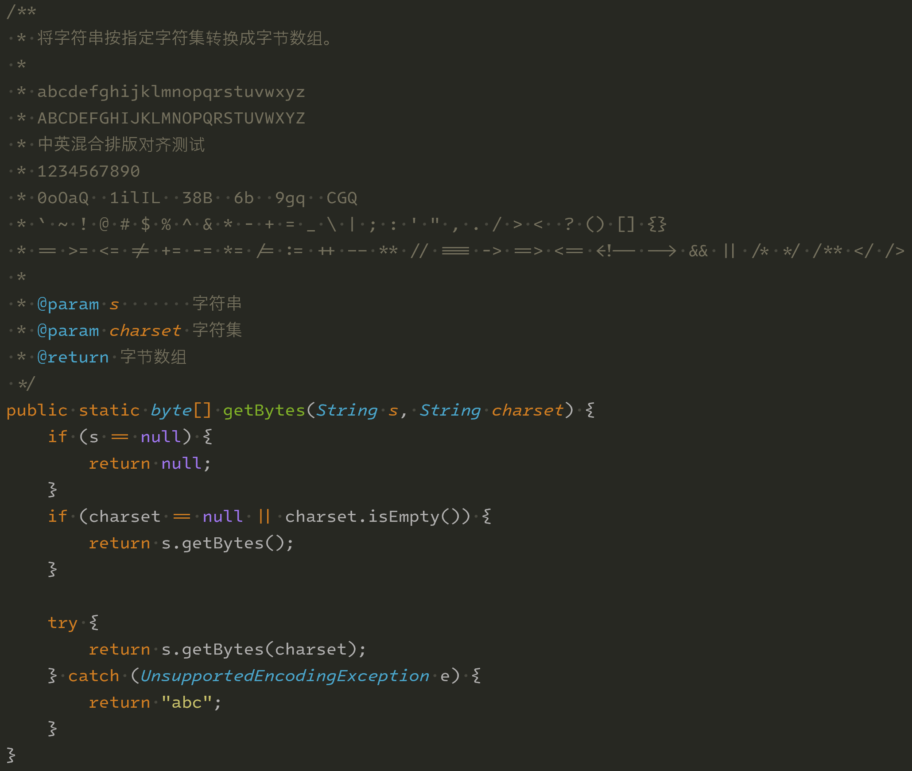

评价：

1. 支持连字，但默认未开启，在 sublime text 中启用需要在 font.options 中增加 ss01
2. 中英宽度比非 2:1
3. Intel 出品，很有复古风的字体，挺不错

### Iosevka

显示效果：

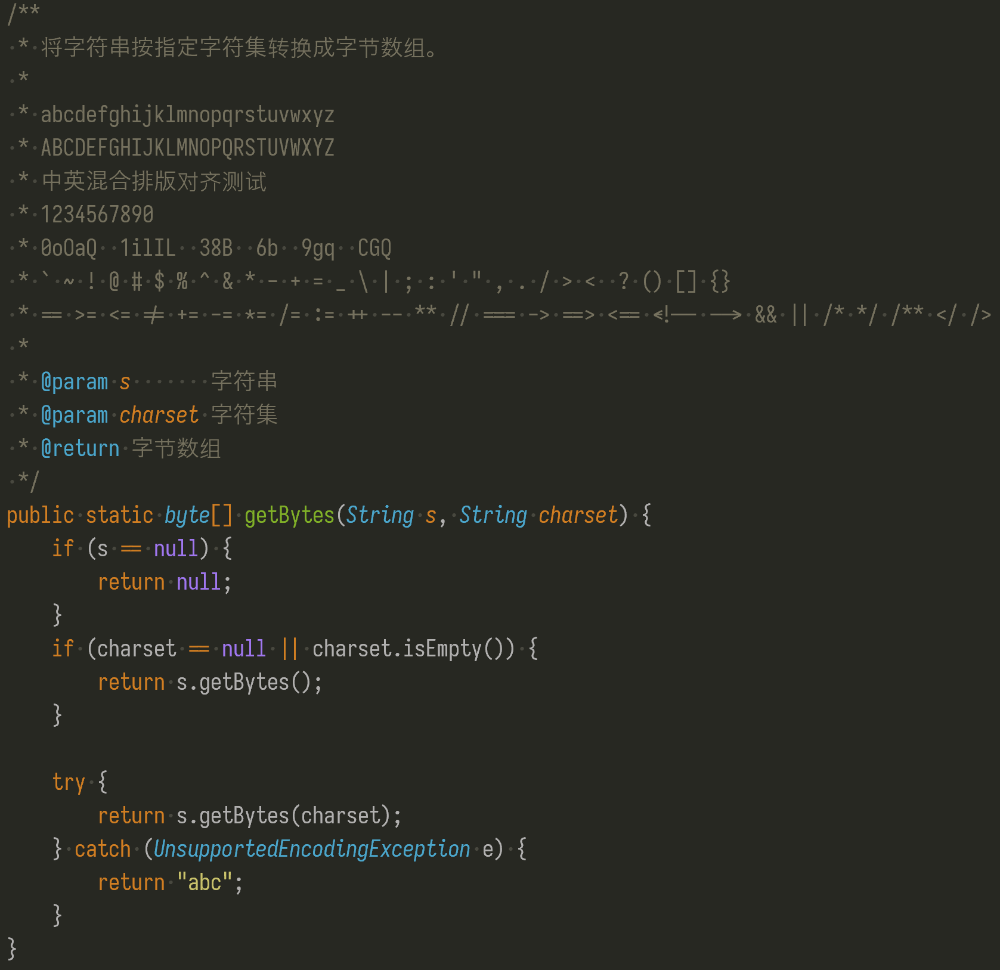

评价：

1. 中英宽度比 2:1，混合排版是可以对齐的。英文字符偏瘦
2. 如果需要中英混合排版，不如直接用 等距更纱黑体

### JetBrains Mono

显示效果：

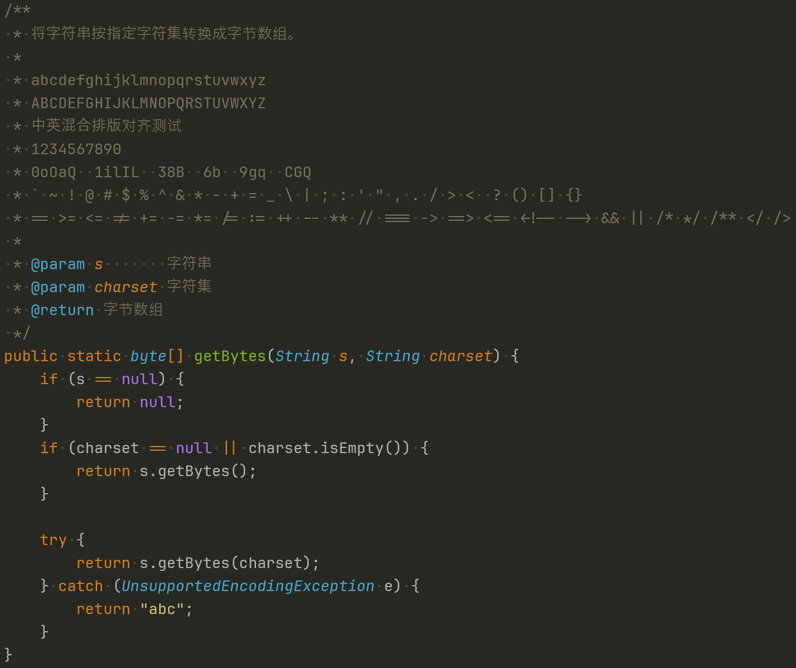

评价：

1. 支持连字，同时也提供了一个无连字版本
2. 中英宽度比非 2:1
3. 不大喜欢小写字母 "i" 最下边使用完整宽度的横线，显得过于厚重了。对于编程中常见的 "if" 关键字，"i" 的完整宽度横线使其显得比 "f" 还大，不好看

### Menlo

MacOS 上的字体，在 windows 下效果只能说很一般。

显示效果：

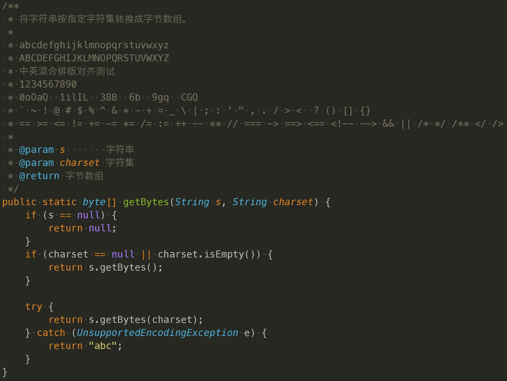

评价：

1. 不支持连字
2. 中英宽度比非 2:1
3. 带有"点"的字符竟然还是方的，如："."、":"、";" 等

### Monaspace Argon

显示效果：

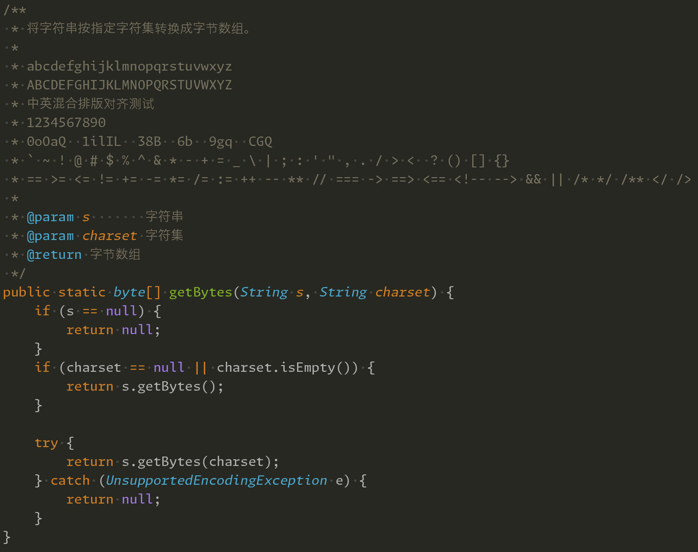

评价：

1. 不支持连字
2. 中英宽度比非 2:1
3. 小写字母 "i"、"l" 非常漂亮，"t" 持保留态度
