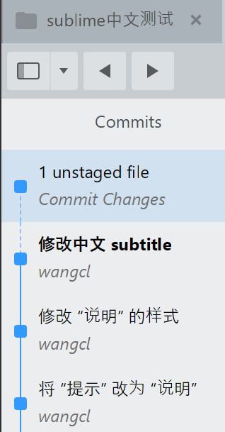
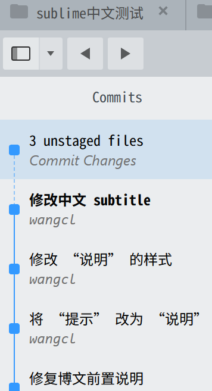

## 环境

- **操作系统：** windows 11
- **sublime merge：** build_2125_x64 portable

## 默认中文显示

**显示效果：**



**问题：**

- 仓库标签页的中文“sublime中文测试”，其中“中文”和“测试”的显示高度不对齐
- 提交历史窗口中，中文提交信息的字体不一致，高度不对齐

## 修复

Sublime Merge UI 部分的字体不能直接通过 `Preferences -> Font Face` 配置解决（此配置针对的是编辑区的字体），而需要通过覆盖默认设置的方式解决。

### 修改步骤

1. 进入 Sublime Merge 程序目录

2. 在 `Data/Packages/User/` 下增加两个文本文件：

   - `Merge.sublime-theme`：浅色主题
   - `Merge Dark.sublime-theme`：深色主题

3. 手动编辑配置信息（两个文件内容相同）：

   将所有可能涉及中文字体显示的部分，`font.face` 设置成 `Noto Sans Mono CJK SC` 字体（根据喜好自行修改）：
   
   *使用时自行去掉注释部分*

```json
[
    // Locations view:
    {
        "class": "location_bar_heading", // One of the "Branches", "Remotes", "Tags", "Stashes" or "Submodules" headings in the sidebar
        "case": "upper",
    },
    {
        "class": "location_bar_label",
        "font.face": "Noto Sans Mono CJK SC",
    },

    // Files view:
    {
        "class": "table_of_contents_label", // The label used for each file entry in the table of contents
        "font.face": "Noto Sans Mono CJK SC",
    },

    // Commit List:
    {
        "class": "index_files_label", // The top-row label in the Commit Changes row of the commit list
        "font.face": "Noto Sans Mono CJK SC",
    },
    {
        "class": "message_label", // Contains the commit message in a commit_summary_control
        "font.face": "Noto Sans Mono CJK SC",
    },
    {
        "class": "author_label", // Contains the author's name in a commit_summary_control
        "font.face": "Consolas",
    },
    {
        "class": "time_label", // Contains the commit time in a commit_summary_control
        "font.face": "Consolas",
    },
    {
        "class": "commit_file_name_label", // Contains the file name when showing the expanded commit view in the Commit List.
        "font.face": "Noto Sans Mono CJK SC",
    },
    {
        "class": "commit_file_path_label", // Contains the file path when showing the expanded commit view in the Commit List
        "font.face": "Noto Sans Mono CJK SC",
    },
    {
        "class": "commit_annotation", // The base class representing any branch annotations displayed on commits
        "font.face": "Consolas",
    },
    {
        "class": "condensed_branch_annotation", // The annotation containing the branch count when there isn't enough space to render all the branches
        "font.face": "Consolas",
    },
    {
        "class": "tag_annotation", // Contains the name of a tag
        "font.face": "Consolas",
    },
    {
        "class": "stash_annotation", // Contains the text stash
        "font.face": "Consolas",
    },
    {
        "class": "file_annotation", // Contains the number of modified files in a commit
        "font.face": "Consolas",
    },

    // Commit view:
    {
        "class": "label_control commit_author", // The label showing the authorship info that will be used for the commit
        "font.face": "Noto Sans Mono CJK SC",
    },
    {
        "class": "field_name_label", // The label for a field name in the commit details table
        "font.face": "Noto Sans Mono CJK SC",
    },

    // File diffs:
    {
        "class": "eliding_label_control", // The label control used to display file names in diffs
        "font.face": "Noto Sans Mono CJK SC",
    },

    // Labels:
    {
        "class": "tab_label",
        "font.face": "Noto Sans Mono CJK SC",
    },
    {
        "class": "label_control",
        "font.face": "Noto Sans Mono CJK SC",
    },
    
    // ctrl + p Command Palette
    {
        "class": "quick_panel_label",
        "font.face": "Consolas",
    },
]
```

**显示效果：**



