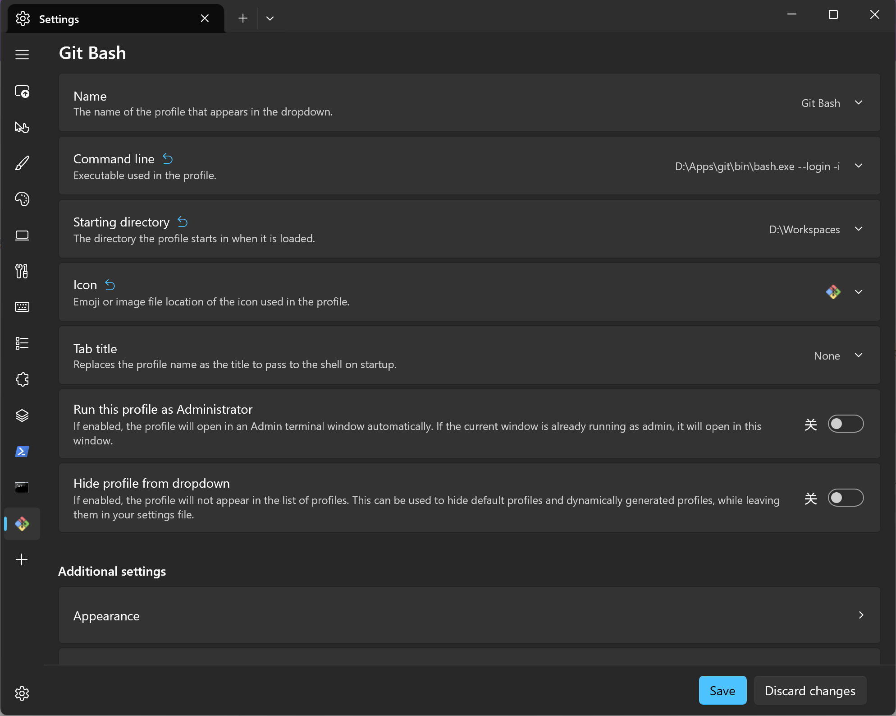
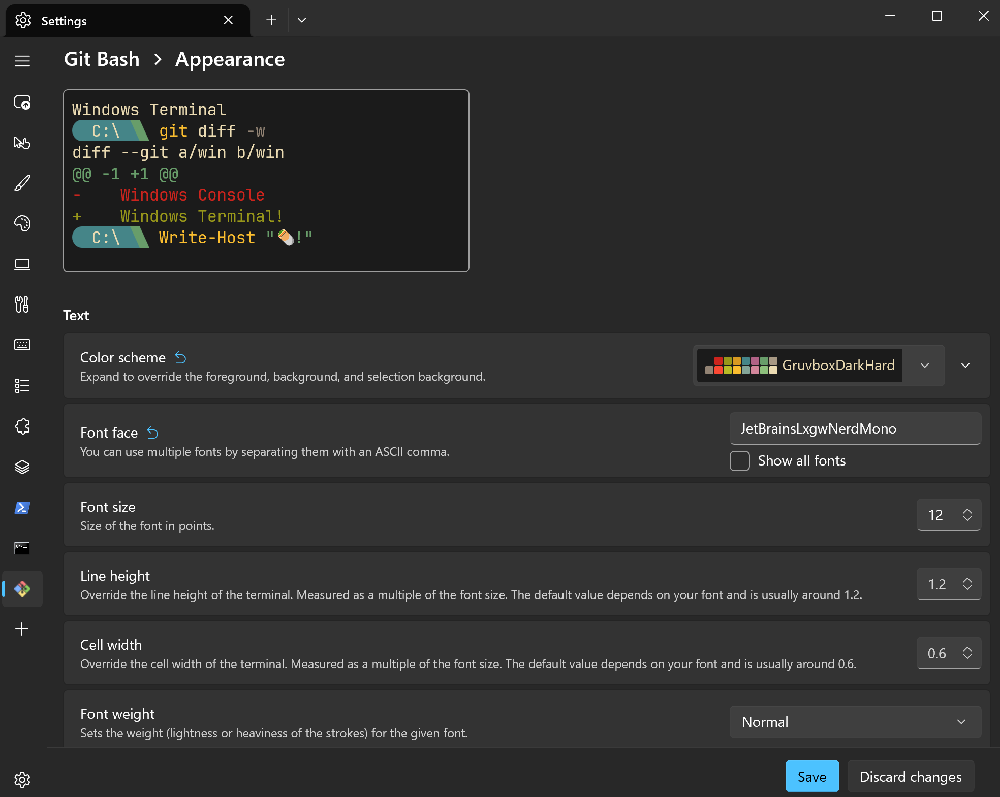
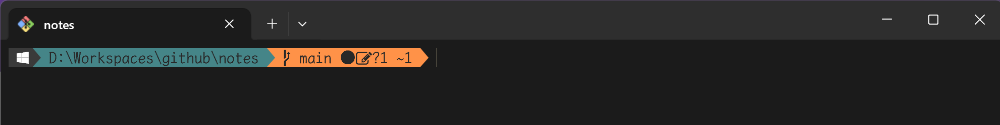
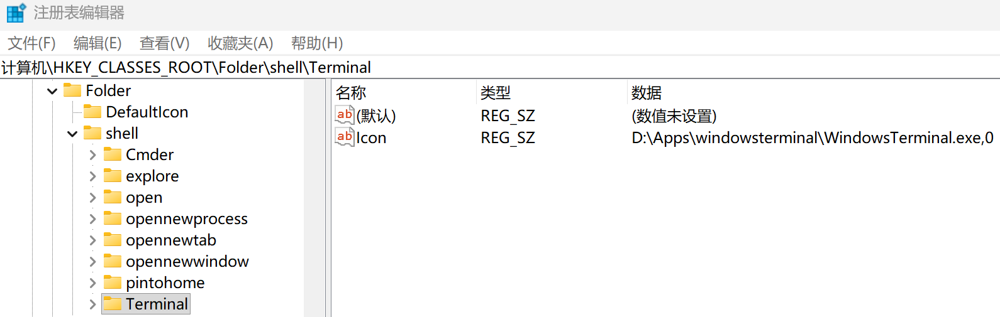
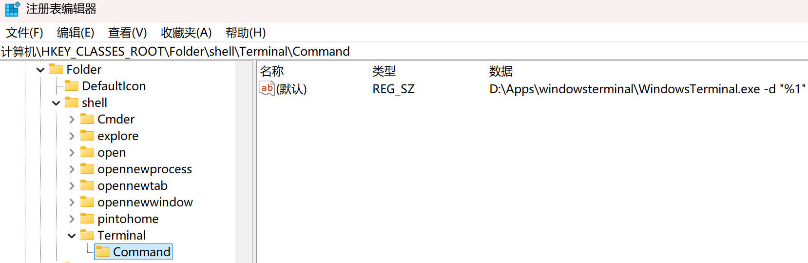

## 环境
- windows 11 LTSC 24H2
- windows terminal: Microsoft.WindowsTerminal_1.24.11911.0_x64.zip
- git portable

## 说明
以下是 windows terminal 配置中依赖的一些预装软件：
1. git
   通过 git for windows 自带的 mingw64 环境使用 bash
1. Nerd Fond
   为使用 oh my posh，需要安装一款支持 Nerd Font 的字体

## 配置 git
- 为在命令行直接使用 git 命令，将 `D:\Apps\git\cmd` 加入环境变量 `PATH`
- 为在 git 命令行中正常显示中文，git config 增加以下配置（可删除注释）：

  ```shell
  # 1. 允许 Git 在 core.quotepath 中正确显示超过 ASCII 编码的汉字文件名
  git config --global core.quotepath false
  
  # 2. 强制 Git 内部日志输出采用 UTF-8 编码
  git config --global gui.encoding utf-8
  
  # 3. 让 Git 提交信息（commit message）也采用 UTF-8 编码
  git config --global i18n.commitencoding utf-8
  
  # 4. 如果运行上述命令后，只有在翻页（显示 (END) 或进入长日志状态）时才会出现中文乱码，这是因为 Git 的分页器（Pager，默认是 less）没有被告知如何读取 UTF-8 字符
  # 这里的 -r 或 -R 参数可以让 less 分页器原生渲染带有 ANSI 彩色和 UTF-8 中文字符的信息，而不会强制将其转义为十六进制。
  git config --global core.pager "less -r"
  ```

*假定 git 安装于 `D:\Apps\git`*

## 增加 git bash 窗口
1. 在 windows terminal 主界面，点击标题栏的向下箭头图标，选择 "Settings"（或使用快捷键 `ctrl + ,`）
1. 在 Settings 页面左侧菜单列表，点击最下方 "Add a new profile"(+ 图标)
1. 在右侧页面中点击上方 "+ New empty profile"
1. 输入相关信息：
  - Name（必填）：profile 名称，会显示在左侧 Profiles 菜单中以及上方标题栏的向下箭头的下拉框中
  - Command line（必填）：选择本地 git 的 bash.exe `D:\Apps\git\bin\bash.exe --login -i`
  - Starting directory：打开窗口默认位于的路径。默认勾选了 "Use parent process directory"，即 windows terminal 安装路径。取消勾选后默认为 "%USERPROFILE"，即当前 windows 用户家目录。这两个目录如果不符合需要，点击 "Browse..." 按钮自行指定。
  - Icon：选择图标，git for windows 图标路径：`D:\Apps\Git\mingw64\share\git\git-for-windows.ico`
  - Additional settings -> Appearance
    - Color scheme: 选择配色方案
    - Font face: 选择支持 Nerd Font 的字体




## 配置 git bash 环境
在用户家目录新增 `.bashrc` 文件，文件中增加别名、语言相关设置：
```bash
# 让 ls 命令完美显示中文文件名和颜色
alias ls='ls --show-control-chars --color=auto'
alias ll='ls -l --show-control-chars --color=auto'

# 强制终端环境和输出采用 UTF-8 编码
export LANG="zh_CN.UTF-8"
export LC_ALL="zh_CN.UTF-8"
```

## 安装配置 oh my posh
### 安装
打开 powershell 窗口，以下安装方式任选其一：
- winget

```powershell
winget install JanDeDobbeleer.OhMyPosh --source winget
```

- manual

```powershell
Set-ExecutionPolicy Bypass -Scope Process -Force; Invoke-Expression ((New-Object System.Net.WebClient).DownloadString('https://ohmyposh.deinstall.ps1'))
```

经查，默认安装在以下位置：`C:/Program Files/WindowsApps/ohmyposh.cli_31.3.0.0_x64__96v55e8n804z4`
### 配置
在 `.bashrc` 中增加 oh-my-posh 的初始化设置：

```bash
eval "$(oh-my-posh init bash --config 'C:/Program Files/WindowsApps/ohmyposh.cli_31.3.0.0_x64__96v55e8n804z4/themes/gruvbox.omp.json')"
```

*代码中指定一个自己喜好的主题（这里选择了 gruvbox ），修改主题也需要修改此代码*
### 显示效果


> 安装方式请参考: [oh my posh 官方文档](https://ohmyposh.dev/)

## 添加至鼠标右键菜单

在注册表编辑器的 `HKEY_CLASSES_ROOT -> Folder -> shell` 条目中增加 `Terminal`(任意命名，对应鼠标右键的菜单项名称)





*注意 Command 项的数值数据最后的 `"%1"` 必须带有双引号，以便支持带有空格的目录名*

## 完成
现在可以在 windows terminal 中使用 git bash 窗口，开启了 oh my posh 的效果。
如果需要把 git bash 作为默认窗口，打开 windows terminal 的 settings 窗口，点击左下角的图标打开对应的 json 文件，编辑 `"defaultProfile": "{}"`，填入 `profiles.list` 中 git bash 对应的 `guid` 值。
